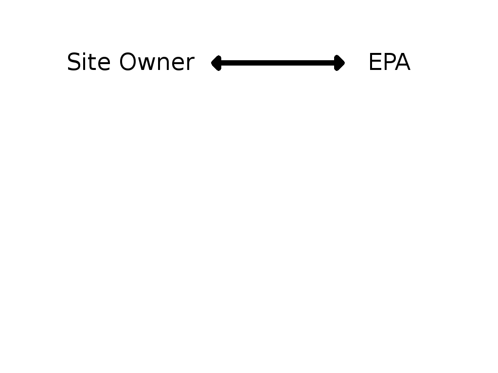
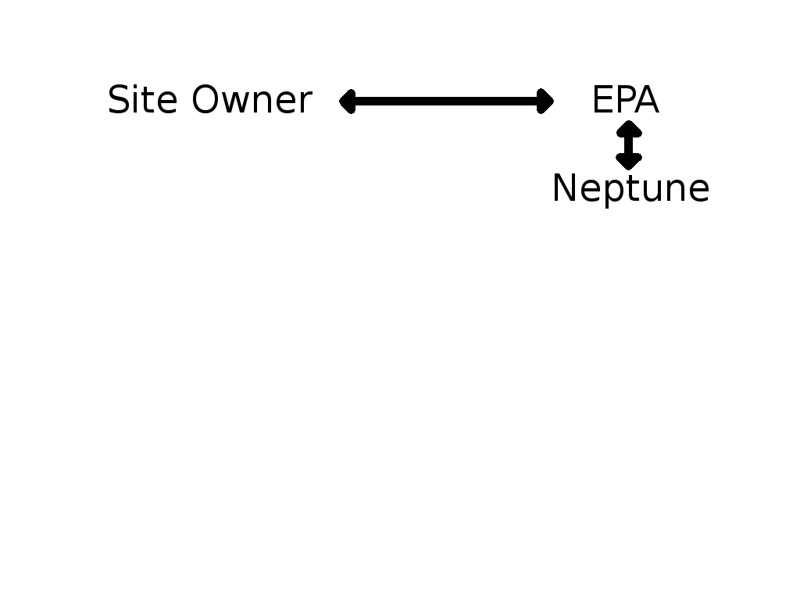
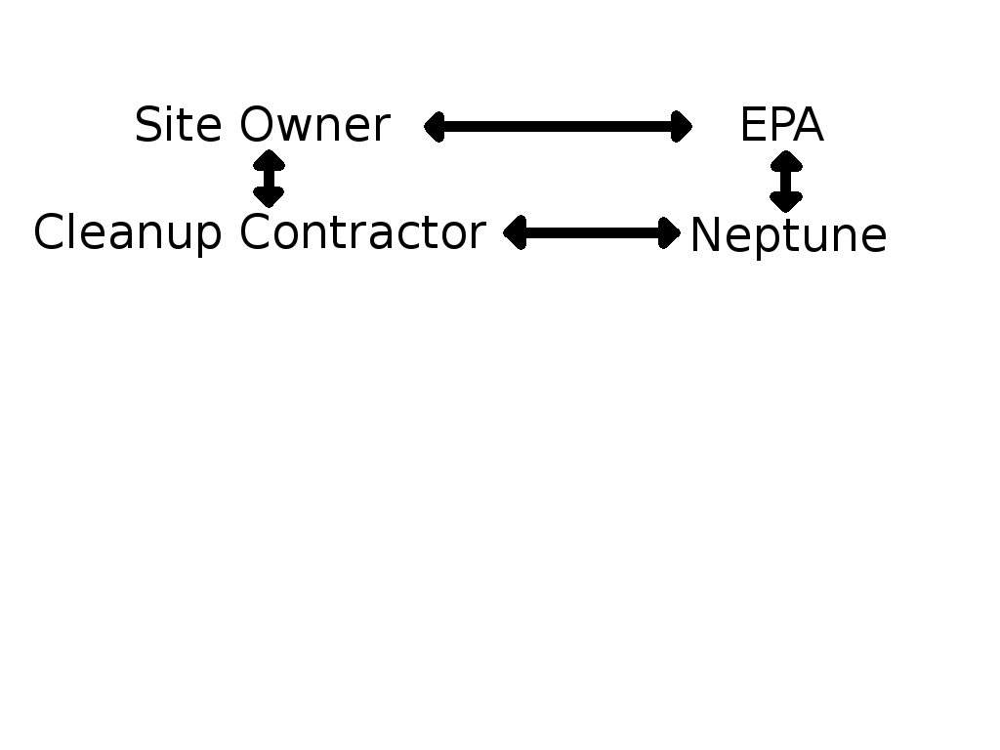
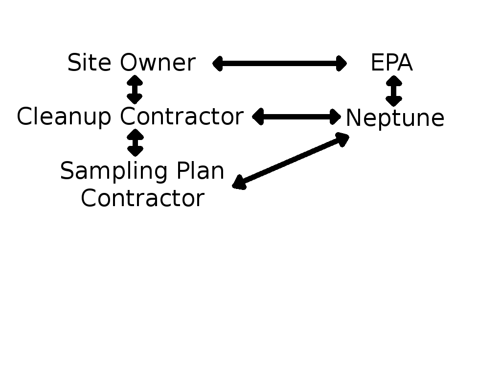
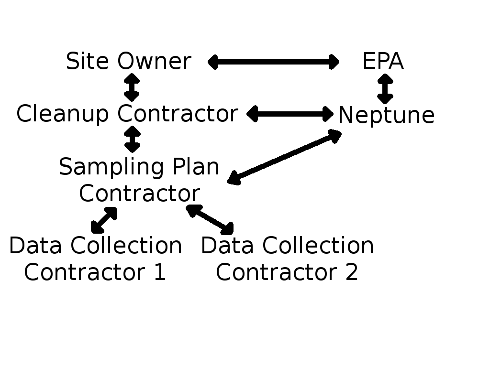
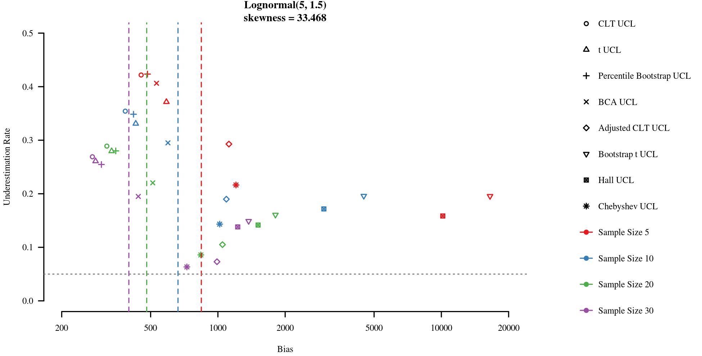
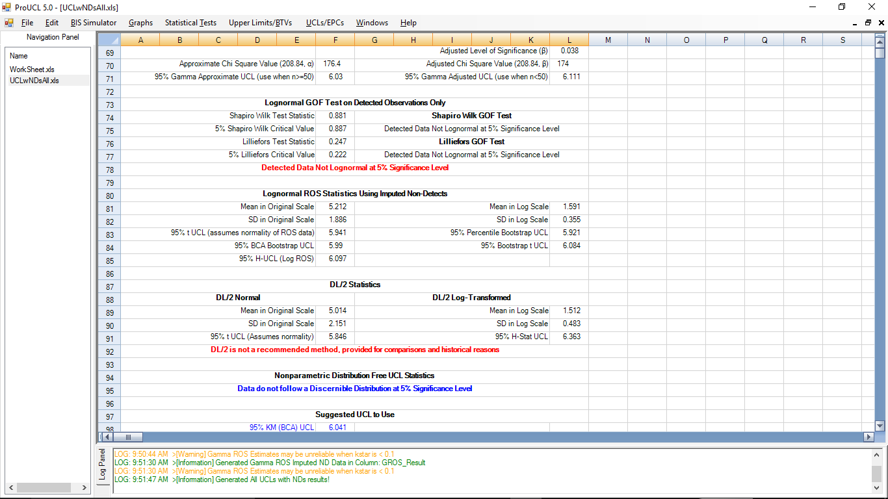
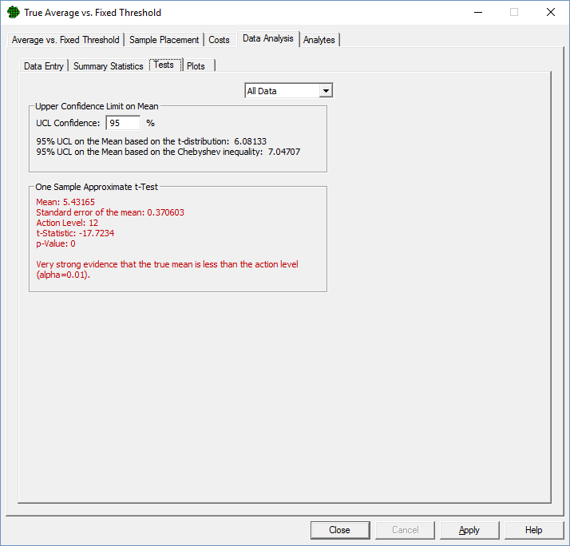

```{r setup, cache=FALSE, echo=FALSE, message=FALSE, warning=FALSE}
library(knitr)
opts_chunk$set(cache=TRUE, echo=FALSE, warning=FALSE, message=FALSE,
  fig.width=10, fig.height=6, dpi=150, fig.align='center',
  dev.args=list(family='serif', pointsize=21, bg = '#f7f2d300'))
library(EnvStats)
```


# Introduction


## Neptune & Company

- Internship at Lakewood, CO office
- Consulting firm, founded 1992
    - Environmental Statisics
    - Bayesian decision theory/risk management
- About 50 employees around the US
- Origins with EPA


## Overview

- Colorado
- Work at Neptune
- Some Environmental Statistics Topics
- Thoughts on Internships


# Colorado


## Mt Bierstadt


## Geneva City


## A Local


# Work at Neptune


## Projects

- Environmental risk assessment
<!-- Usually deterministic because of guidance -->
- Mathematical modeling
- Radiological performance assessment
- Unexploded ordnance cleanup
- Sampling plans
- Web-based analysis and visualization tools


## A Few Sites

- Hanford Site
<!-- produced putoneum for nuclear weapons, now being monitored/cleaned/closed -->
- Los Alamos National Lab
- Nevada Test Site
<!-- Radiological exposure risk assessment for workers near nuclear test site -->
- Helena Valley


## My Job -- Statistics Intern

- Assist PhD statisticians
    - Analyze/plot data
    - Sampling plans
    - Writups
- Statistical methods paper
- Assist with Visual Sample Plan software
- Input on workflow/project organization


## Anatomy of an Environmental Cleanup

- Statistics are just one small piece
- 80-page risk assessment becomes Appendix D of 500-page report
- Reports done in MS Word


## Anatomy of an Environmental Cleanup {data-transition="fade"}



## Anatomy of an Environmental Cleanup {data-transition="none"}



## Anatomy of an Environmental Cleanup {data-transition="none"}



## Anatomy of an Environmental Cleanup {data-transition="none"}



## Anatomy of an Environmental Cleanup {data-transition="none"}




# Some Environmental Statistics Topics


## Upper Confidence Limits

- Regulators/risk assessors want to be "protective"
- Prefer to overestimate mean contamination concentration
- Testing mean -- Reject $H_0 \iff$ UCL > Action Level
- 95% UCL is a conservative estimate
<!-- Assuming your sample is typical, UCL could be the average of a sample of
large values. -->


## Upper Confidence Limits {data-transition="fade"}

```{r uclex1}
curve(dlnorm(x, 3, 0.5), from = 0, to = 100, bty = 'n', yaxt = 'n', n = 1001,
      main = 'Lognormal(3, 0.05) Density, mean = 22.76', xlab = '', ylab = '',
      ylim = c(0, 0.11))
```

## Upper Confidence Limits {data-transition="none"}

```{r uclex2}
set.seed(32521)
avgs <- replicate(10000, mean(rlnorm(10, 3, 0.5)))
hist(avgs, freq = FALSE, breaks = 100, border = 'darkgrey', col = 'lightgrey',
     bty = 'n', yaxt = 'n', main = 'Distribution of Sample Average, n = 10',
     xlab = '', ylab = '', xlim = c(0, 100), ylim = c(0, 0.11))
curve(dlnorm(x, 3, 0.5), from = 0, to = 100,n = 1001, add = TRUE)
```

## Upper Confidence Limits {data-transition="none"}

```{r uclex3}
hist(avgs, freq = FALSE, breaks = 100, border = 'darkgrey', col = 'lightgrey',
     bty = 'n', yaxt = 'n', main = 'True Mean and 95% UCL of the Mean',
     xlab = '', ylab = '', xlim = c(0, 100), ylim = c(0, 0.11))
curve(dlnorm(x, 3, 0.5), from = 0, to = 100,n = 1001, add = TRUE)
abline(v = c(exp(3+0.5^3), quantile(avgs, 0.95)), col = c('blue', 'red'), lwd = 2)
```

## Upper Confidence Limits {data-transition="none"}

```{r uclex4}
hist(avgs, freq = FALSE, breaks = 100, border = 'darkgrey', col = 'lightgrey',
     bty = 'n', yaxt = 'n', main = 'Normal Approximation',
     xlab = '', ylab = '', xlim = c(0, 100), ylim = c(0, 0.11))
curve(dlnorm(x, 3, 0.5), from = 0, to = 100,n = 1001, add = TRUE)
abline(v = c(exp(3+0.5^3), quantile(avgs, 0.95)), col = c('blue', 'red'), lwd = 2)
curve(dnorm(x, exp(3.125), sqrt(exp(6.25)*(exp(0.25)-1)/10)), n = 1001,
      col = 'darkblue', lwd = 2, add = TRUE)
```

## Upper Confidence Limits {data-transition="none"}

```{r uclex5}
hist(avgs, freq = FALSE, breaks = 100, border = 'darkgrey', col = 'lightgrey',
     bty = 'n', yaxt = 'n', main = '95th Normal Percentile',
     xlab = '', ylab = '', xlim = c(0, 100), ylim = c(0, 0.11))
curve(dlnorm(x, 3, 0.5), from = 0, to = 100,n = 1001, add = TRUE)
abline(v = c(exp(3+0.5^3), quantile(avgs, 0.95), qnorm(0.95, mean(avgs), sd(avgs))),
       col = c('blue', 'red', 'maroon'), lwd = 2)
curve(dnorm(x, exp(3.125), sqrt(exp(6.25)*(exp(0.25)-1)/10)), n = 1001,
      col = 'darkblue', lwd = 2, add = TRUE)
```


## Computing (1-$\alpha$)100% UCLs

### Normal UCL

$$\bar{x}+z_\alpha\frac{s}{\sqrt{n}}$$

### $t$ UCL

$$\bar{x}+t_{n-1,\alpha}\frac{s}{\sqrt{n}}$$

### Chebyshev UCL

$$\bar{x}+\sqrt{\frac{1}{\alpha}-1}\frac{s}{\sqrt{n}}$$
[@singh97]


## Computing (1-$\alpha$)100% UCLs

- Many others have been proposed
    - Lognormal
    - Gamma
    - Skew-adjusted normal/$t$
    - Bootstrap


## Example

Groundwater aluminium concentrations from Naval Construction Battalion Center,
RI [@singh02]

- 290, 113, 264, 2660, 586, 71, 527, 163, 107,
  71, 5920, 979, 2640, 164, 3560, 13200, 125
- Mean: 1849.41
- Std. Dev.: 3351.27

| UCL                  |   Value |
|:--------------------:|--------:|
| Normal               | 3186.47 |
| $t$                  | 3268.22 |
| Skew-adjusted normal | 3675.94 |
| Chebyshev            | 5482.64 |
| Lognormal            | 9102.73 |


## Which UCL Should I Use?

- Lots of confusing guidance
- Based on coverage rate, ignore bias and variance
- Error-prone goodness-of-fit tests


## Which UCL Should I Use?




## Non-Detects

- Data come from chemical analyses
- Labs censor values below a detection limit (DL)
- Report DL instead of result
    - We don't have real numbers!


## Problems Estimating Variability

```{r nd1}
set.seed(317)
fake1 <- rgamma(20, 10, 2)
set.seed(5316)
df <-data.frame(Concentration = c(fake1, ifelse(fake1 < 4, 4, fake1)),
                Sample = rep(1:2, each = 20) + rep(runif(20, -0.2, 0.2), 2),
                cens = c(rep(FALSE, 20), (fake1 < 4)))
means <- tapply(df$Concentration, ifelse(df$Sample < 1.5, 'Raw', 'Censored'),
                mean)[c('Raw', 'Censored')]
sds <- tapply(df$Concentration, ifelse(df$Sample < 1.5, 'Raw', 'Censored'),
              sd)[c('Raw', 'Censored')]
ucls <- means + qt(0.95, 19) * sds / sqrt(20)
mean2 <- mean(ifelse(fake1 < 4, 2, fake1))
sd2 <- sd(ifelse(fake1 < 4, 2, fake1))
ucl2 <- mean2 + qt(0.95, 19) * sd2 / sqrt(20)
km <- enparCensored(df$Concentration[df$Sample > 1.5],
                    df$cens[df$Sample > 1.5],
                    ci = TRUE, ci.type = 'upper')
cohen <- enormCensored(df$Concentration[df$Sample > 1.5],
                       df$cens[df$Sample > 1.5],
                       ci = TRUE, ci.type = 'upper')
par(mar = c(4.1, 4.1, 4.1, 4.1), bty = 'n')
plot(Concentration ~ Sample, data = df,
     pch = ifelse(df$cens, 6, 19), col = ifelse(df$cens, 'red', 'blue'),
     xlim = c(0.5, 2.5), xaxt = 'n')
axis(1, at = 1:2, labels = c('Raw', 'Censored'))
axis(3, at = 1:2, tick = FALSE, labels = paste0('mean = ', round(means, 3),
                                                '\nsd = ', round(sds, 3),
                                                '\nt-UCL = ', round(ucls, 3)))
```


## Accounting for Non-Detects

- Simple substitutions (DL/2)
- Several MLEs
    - Must assume a distribution
- One decent nonparametric method -- Kaplan-Meier [@helselbook]
    - Debate about implementation
- Non-detects really a data quality issue


## Accounting for Non-Detects

```{r nd2}
dfu <- data.frame(Mean = c(means, mean2, km$parameters['mean'],
                           cohen$parameters['mean']),
                  SD = c(sds, sd2, km$parameters['sd'],
                         cohen$parameters['sd']),
                  tUCL = c(ucls, ucl2,
                              km$interval$limits['UCL'],
                              cohen$interval$limits['UCL']),
                  row.names = c('Raw', 'DL', 'DL/2', 'Kaplan-Meier', 'Normal MLE'))
colnames(dfu)[3] <- '_t-UCL_'
kable(dfu, digits = 3)
```


## Detection Limits are Complicated

```{r nd3}
par(mar = c(4.1, 7.1, 2.1, 7.1))
set.seed(5161)
weird <- rnorm(20, 0.1, 0.01) * c(rep(1, 19), 0.01)
qqnorm(weird, pch = 6, col = 'red', bty = 'n')
qqline(weird, lty = 3)
```

## Detection Limits are Complicated

```{r nd4}
par(mar = c(4.1, 7.1, 2.1, 7.1))
x.coord <- rep(c(1, 3, 2, 4), 5)
y.coord <- rep(1:10, each = 2)
weird.order <- sort(weird)
weird.order[c(1, 3)] <- weird.order[c(3, 1)]
weird.colors <- rgb((weird.order/max(weird.order))^2, 0, 0)
plot(y.coord ~ x.coord, pch = 16, col = weird.colors, bty = 'n',
     xlab = 'Horizontal Position', ylab = 'Vertical Position')
```


## Software and De-Facto Standards

- ProUCL developed by EPA [@proucl]
    - Developers involved in most UCL simulation studies
- Visual Sample Plan developed by PNNL [@vsp]
    - Funded by DOE
- Handful of R packages


## ProUCL




## VSP




# Thoughts on Internships


## A "Real Job"

- More money
- Less work
- Weekends!


## A Different Learning Experience

<!-- As an intern, -->
- Expected to know statistics
    - But not "these" statistics
    - Allowed time to learn on the job
- Saw connections between policy and real-world science
- Less research


# References


## References
