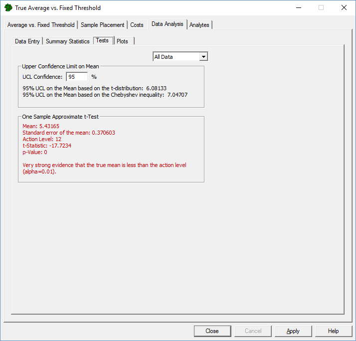

In the Field: A Crash Course in Environmental Statistics
================
Kenneth A. Flagg

Introduction
============

Neptune & Company
-----------------

-   Internship at Lakewood, CO office
-   Consulting firm, founded 1992
    -   Environmental Statisics
    -   Bayesian decision theory/risk management
-   About 50 employees around the US
-   Origins with EPA

Overview
--------

-   Colorado
-   Work at Neptune
-   Some Environmental Statistics Topics
-   Thoughts on Internships

Colorado
========

Mt Bierstadt
------------

Geneva City
-----------

A Local
-------

Work at Neptune
===============

Projects
--------

-   Environmental risk assessment <!-- Usually deterministic because of guidance -->
-   Mathematical modeling
-   Radiological performance assessment
-   Unexploded ordnance cleanup
-   Sampling plans
-   Web-based analysis and visualization tools

A Few Sites
-----------

-   Hanford Site <!-- produced putoneum for nuclear weapons, now being monitored/cleaned/closed -->
-   Los Alamos National Lab
-   Nevada Test Site <!-- Radiological exposure risk assessment for workers near nuclear test site -->
-   Helena Valley

My Job -- Statistics Intern
---------------------------

-   Assist PhD statisticians
    -   Analyze/plot data
    -   Sampling plans
    -   Writups
-   Statistical methods paper
-   Assist with Visual Sample Plan software
-   Input on workflow/project organization

Anatomy of an Environmental Cleanup
-----------------------------------

-   Statistics are just one small piece
-   80-page risk assessment becomes Appendix D of 500-page report
-   Reports done in MS Word

Anatomy of an Environmental Cleanup
-----------------------------------

Anatomy of an Environmental Cleanup
-----------------------------------

Anatomy of an Environmental Cleanup
-----------------------------------

Anatomy of an Environmental Cleanup
-----------------------------------

Anatomy of an Environmental Cleanup
-----------------------------------

Some Environmental Statistics Topics
====================================

Upper Confidence Limits
-----------------------

-   Regulators/risk assessors want to be "protective"
-   Prefer to overestimate mean contamination concentration
-   Testing mean -- Reject \(H_0 \iff\) UCL &gt; Action Level
-   95% UCL is a conservative estimate <!-- Assuming your sample is typical, UCL could be the average of a sample of
    large values. -->

Upper Confidence Limits
-----------------------

Upper Confidence Limits
-----------------------

Upper Confidence Limits
-----------------------

Upper Confidence Limits
-----------------------

Upper Confidence Limits
-----------------------

Computing (1-\(\alpha\))100% UCLs
---------------------------------

### Normal UCL

\[\bar{x}+z_\alpha\frac{s}{\sqrt{n}}\]

### \(t\) UCL

\[\bar{x}+t_{n-1,\alpha}\frac{s}{\sqrt{n}}\]

### Chebyshev UCL

\[\bar{x}+\sqrt{\frac{1}{\alpha}-1}\frac{s}{\sqrt{n}}\] (A. K. Singh, Singh, and Engelhardt 1997)

Computing (1-\(\alpha\))100% UCLs
---------------------------------

-   Many others have been proposed
    -   Lognormal
    -   Gamma
    -   Skew-adjusted normal/\(t\)
    -   Bootstrap

Example
-------

Groundwater aluminium concentrations from Naval Construction Battalion Center, RI (Singh, Singh, and Iaci 2002)

-   290, 113, 264, 2660, 586, 71, 527, 163, 107, 71, 5920, 979, 2640, 164, 3560, 13200, 125
-   Mean: 1849.41
-   Std. Dev.: 3351.27

|          UCL         |    Value|
|:--------------------:|--------:|
|        Normal        |  3186.47|
|         \(t\)        |  3268.22|
| Skew-adjusted normal |  3675.94|
|       Chebyshev      |  5482.64|
|       Lognormal      |  9102.73|

Which UCL Should I Use?
-----------------------

-   Lots of confusing guidance
-   Based on coverage rate, ignore bias and variance
-   Error-prone goodness-of-fit tests

Which UCL Should I Use?
-----------------------

Non-Detects
-----------

-   Data come from chemical analyses
-   Labs censor values below a detection limit (DL)
-   Report DL instead of result
    -   We don't have real numbers!

Problems Estimating Variability
-------------------------------

Accounting for Non-Detects
--------------------------

-   Simple substitutions (DL/2)
-   Several MLEs
    -   Must assume a distribution
-   One decent nonparametric method -- Kaplan-Meier (Helsel 2011)
    -   Debate about implementation
-   Non-detects really a data quality issue

Accounting for Non-Detects
--------------------------

|              |   Mean|     SD|  *t-UCL*|
|--------------|------:|------:|--------:|
| Raw          |  5.319|  1.757|    5.999|
| DL           |  5.414|  1.662|    6.057|
| DL/2         |  5.014|  2.151|    5.846|
| Kaplan-Meier |  5.414|  1.620|    5.963|
| Normal MLE   |  5.179|  1.922|    5.915|

Detection Limits are Complicated
--------------------------------

Detection Limits are Complicated
--------------------------------

Software and De-Facto Standards
-------------------------------

-   ProUCL developed by EPA (EPA 2016)
    -   Developers involved in most UCL simulation studies
-   Visual Sample Plan developed by PNNL (VSP Development Team 2016)
    -   Funded by DOE
-   Handful of R packages

ProUCL
------

VSP
---

Thoughts on Internships
=======================

A "Real Job"
------------

-   More money
-   Less work
-   Weekends!

A Different Learning Experience
-------------------------------

<!-- As an intern, -->
-   Expected to know statistics
    -   But not "these" statistics
    -   Allowed time to learn on the job
-   Saw connections between policy and real-world science
-   Less research

References
==========

References
----------

EPA. 2016. *ProUCL Version 5.1.002, Statistical Software for Environmental Applications for Data Sets with and Without Nondetect Observations*. United States Environmental Protection Agency. <https://www.epa.gov/land-research/proucl-software>.

Helsel, Dennis R. 2011. *Statistics for Censored Environmental Data Using Minitab and R*. Vol. 77. John Wiley & Sons.

Singh, Anita, Ashok K Singh, and Ross Iaci. 2002. “Estimation of the Exposure Point Concentration Term Using a Gamma Distribution,” no. EPA/600/R-02/084. United States Environmental Protection Agency.

Singh, Ashok K, Anita Singh, and Max Engelhardt. 1997. “The Lognormal Distribution in Environmental Applications,” no. EPA/600/R-97/006.

VSP Development Team. 2016. *Visual Sample Plan: A Tool for Design and Analysis of Environmental Sampling*. Richland, Washington: Pacific Northwest National Laboratory. <http://vsp.pnnl.gov/>.
